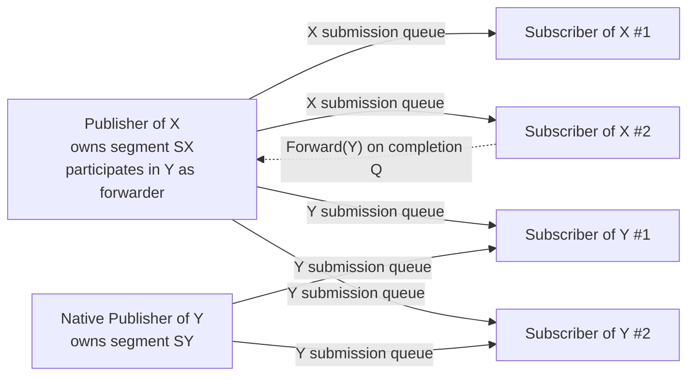

# Publish-Subscribe Forwarding (Verdict-Routed Pub/Sub)

## Terminology

* **Publish-Subscribe Messaging Pattern** – Uni-directional broadcast
  communication where a publisher sends a stream of data to one or more
  subscribers.
* **Sample** – A subscriber-side handle to a single message; in iceoryx2 it
  carries raw pointers into the publisher's data segment rather than a copy
  of the payload.
* **Data Segment** – The shared-memory region owned by a publisher and
  carved into fixed-size buckets by a pool allocator. Subscribers map it
  read-only.
* **Submission Queue** – Per-(publisher, subscriber) lock-free queue used
  to deliver `PointerOffset` values from publisher to subscriber.
* **Completion Queue** – Per-(publisher, subscriber) lock-free queue
  used by a subscriber to communicate sample-lifecycle operations to
  the publisher. Each entry is a fixed-size variant (`Drop`, `Forward`,
  or `DropAndForward`). FIFO order is the linearization point for the
  publisher's refcount adjustments.
* **Forwarder** – A subscriber that may issue `Forward` or
  `DropAndForward` operations on a `Sample`, requesting the sample be
  re-emitted on another publish-subscribe service. Issuing a `Forward`
  does not release the forwarder's own borrow.
* **Forwarding Participation** – A publisher of source service `X`
  that declares `forwards_into(["Y"])` participates in service `Y` as
  an additional publisher visible to `Y`-subscribers. Its participation
  is *forwarding-only*: it never loans buckets onto `Y`. The offsets it
  emits onto `Y` submission queues are always relays of `Forward` /
  `DropAndForward` entries issued by subscribers of `X`. The publisher's
  own `loan()` API continues to allocate buckets for `X`'s native
  traffic, unchanged.
* **Source-Governed Forwarding** – The routing policy for a bucket is
  determined entirely by the service whose publisher allocated it.
  `forwards_into` is declared on the source service; the dispatching
  publisher is always the original allocator. A subscriber on an
  intermediate service that re-forwards a bucket is acting as a
  delegate of the bucket's origin, not as an independent authority —
  intermediate services do not declare `forwards_into` for buckets
  they did not allocate.
* **Per-Bucket Forwarding History** – A publisher-local bitmap kept
  alongside each in-flight bucket's refcount, recording which target
  services the bucket has been forwarded to since its allocation.
  Cleared on bucket reclaim. The publisher consults the bitmap when
  draining `Forward` / `DropAndForward` entries; an entry whose target
  bit is already set is consumed as a no-op (the issuing subscriber's
  borrow is released but no fanout occurs). This is what guarantees
  R10.
* **Verdict** – The operation a forwarder issues per `Sample`: `Drop`,
  `Forward(target)`, or `DropAndForward(target)`. `Keep` is implicit —
  it is the absence of any verdict-issuing call while the subscriber
  still holds the `Sample`.
* **Source Service** – The service `X` whose publisher allocated the
  original bucket.
* **Target Service** – The service `Y` onto which a forwarder re-emits the
  bucket.

## Overview

Today, an iceoryx2 subscriber that wants to expose a derived or filtered
stream of messages to a separate audience must allocate a fresh bucket on
a downstream publisher and copy the payload across. For large payloads
(video frames, point clouds, telemetry blobs) this defeats the zero-copy
property that motivates iceoryx2.

This document proposes **publish-subscribe forwarding** — a capability
extension to the existing PubSub messaging pattern that lets a subscriber
re-emit a received `Sample` onto another PubSub service without copying.
The bucket allocated by the original publisher is reused; its refcount is
extended to cover the subscribers of the target service; and the original
publisher reclaims the bucket only after every reader — original audience
and forwarded audience — has released it.

The shape of the pattern is closest to Linux netfilter's NFQUEUE: each
subscriber returns a per-message verdict (drop, keep, forward to Y) and
the routing decision is made in the consumer, not in a dedicated router
component.

This is **not a new MessagingPattern variant**. With no forwarding routes
declared, behavior is byte-for-byte identical to today's PubSub.

## Requirements

* **R1: Zero-Copy Forwarding** – When a subscriber forwards a `Sample` to
  a target service, no payload copy shall occur. Subscribers of the target
  service read from the original publisher's data segment.
* **R2: Pub/Sub Compatibility** – A PubSub service with no forwarding
  routes declared shall behave identically to a PubSub service today, in
  both wire protocol and runtime cost.
* **R3: Safe Reclamation Under Forwarding** – A bucket shall not be
  reclaimed by its owning publisher until every original-audience
  subscriber *and* every forwarded-audience subscriber has released it.
  The completion-queue protocol shall preserve subscriber-issued
  operation order (`Drop`, `Forward`, `DropAndForward`) end-to-end, so
  that the publisher applies refcount adjustments in the linearization
  order the subscriber chose. Each drained entry's refcount adjustment
  and submission-queue fanout shall complete before the publisher
  performs any further bookkeeping step that could observe the
  refcount.
* **R4: Declared Authorization** – Forwarding routes are explicit. A
  publisher declares the services it may forward into; a target service
  declares which sources it accepts forwarders from. Undeclared routes
  shall be rejected at service-attach time.
* **R5: Target-Side Composition Control** – A target service shall be
  configurable as one of: native-only (no forwarders), forwarder-only (no
  native publishers), or mixed.
* **R6: Provenance** – A subscriber of a target service shall be able to
  determine whether a given `Sample` originated natively on that service
  or was forwarded from a source service, without requiring inspection of
  the payload.
* **R7: Liveness** – Forwarded samples shall not strand publisher buckets
  if a forwarding subscriber crashes. Reclamation must remain bounded
  under any forwarder lifecycle.
* **R8: No New Indirection on the Receive Path** – A subscriber of a
  target service shall not pay extra dereference cost per message because
  forwarding is enabled. Forwarded samples are read directly from the
  source publisher's segment, just like native samples are read from a
  native publisher's segment.
* **R9: At-Most-Once Forwarding Per Target Per Sample (Subscriber-
  Side)** – A subscriber shall forward any given held `Sample` to any
  given target service at most once. This makes the per-subscriber
  completion-queue depth statically bounded at service-creation time
  and guarantees that `Drop` capacity is never consumed by `Forward`
  entries.
* **R10: At-Most-Once Delivery Per Bucket Per Target (Publisher-Side)**
  – The publisher shall dispatch each in-flight bucket to each target
  service at most once across its lifetime. Multiple `Forward(T)` or
  `DropAndForward(T)` entries for the same bucket — issued by any
  combination of one or more subscribers across one or more direct or
  re-forwarded paths — collapse to a single dispatch. This eliminates
  both cross-path duplication (the same bucket reaching a target via
  two different paths in the agreed forwarding graph) and within-path
  duplication (multiple subscribers on the same intermediate service
  forwarding the same bucket to the same target). It also implicitly
  prevents forwarding cycles, since revisiting a target is a no-op.

## Use Cases

### Use-Case 1: Triage and Republish

* **As a** subsystem that consumes a high-volume sensor stream
* **I want** to forward only the messages that meet a content predicate
  onto a public service consumed by other components
* **So that** downstream components see a filtered view without me
  copying every payload

* **Given** a service `raw_lidar_scans` and a service `obstacle_scans`
* **When** my subscriber to `raw_lidar_scans` detects an obstacle in a
  scan
* **Then** I forward that `Sample` onto `obstacle_scans` and downstream
  consumers receive the same buffer, zero-copy

### Use-Case 2: Cross-Trust-Domain Exposure

* **As a** trusted process holding a subscription to an internal
  diagnostic stream
* **I want** to expose a sanitized subset of those messages onto a
  service readable by less-privileged processes
* **So that** the privileged segment remains read-protected from the
  unprivileged audience while still permitting controlled visibility

* **Given** a privileged internal service `internal_diag` and a
  less-privileged service `public_diag`
* **When** the gating subscriber decides a message is safe to expose
* **Then** the message is forwarded to `public_diag` and unprivileged
  consumers read it directly from the privileged publisher's segment via
  a read-only mapping established at attach time

### Use-Case 3: Aggregation From Many Sources

* **As a** monitoring component aggregating events from many services
* **I want** the aggregated service to receive forwarded events from each
  source service rather than requiring sources to publish twice
* **So that** sources remain unaware of the aggregator and the
  aggregation is configured declaratively

* **Given** services `service_a`, `service_b`, `service_c` and an
  aggregation service `events_all`
* **When** each source service is configured with
  `forwards_into(["events_all"])`
* **Then** a per-source forwarder runs as part of each source's publisher
  process and re-emits selected samples onto `events_all`

## Usage

### Declaring a forwarding route

The source publisher declares which services it may forward into. The
target service declares which sources it accepts forwarders from. Both
declarations must agree before forwarding is permitted.

```rust
// Source service
let raw_scans = node
    .service_builder(&"raw_lidar_scans".try_into()?)
    .publish_subscribe::<LidarScan>()
    .forwards_into(["obstacle_scans"])
    .open_or_create()?;

// Target service
let obstacles = node
    .service_builder(&"obstacle_scans".try_into()?)
    .publish_subscribe::<LidarScan>()
    .accepts_forwarders_from(["raw_lidar_scans"])
    .publisher_mode(PublisherMode::Mixed)  // default; native + forwarder
    .open_or_create()?;
```

`PublisherMode` controls who may attach as a publisher of the target
service:

* `Mixed` (default) – native publishers and declared forwarders.
* `NativeOnly` – existing PubSub semantics; forwarder attach is rejected.
* `ForwarderOnly` – purely derived service; native publisher creation is
  rejected.

### Forwarding a received sample

A subscriber holds a `Sample` and may issue one of three operations:

* **Drop** – let `sample` go out of scope; the publisher reclaims via
  the existing release path. No change from today.
* **Forward** – `sample.forward_to(&target)` pushes a `Forward` entry
  on the completion queue. **The subscriber retains its borrow** and
  may continue to use the sample or forward it again.
* **DropAndForward** – `sample.drop_and_forward_to(&target)` consumes
  the sample and issues a single fused entry that drops the
  subscriber's borrow *and* forwards to the target.

For multi-target forwarding, call `forward_to` once per target. Fanout
across targets is not atomic — the publisher processes one entry at a
time — but each entry's refcount adjustment is.

Example: triage-and-republish (forward, release locally).

```rust
let subscriber = raw_scans.subscriber_builder().create()?;

while let Some(sample) = subscriber.receive()? {
    if is_obstacle(&sample) {
        sample.drop_and_forward_to(&obstacles)?;  // consumes sample
    }
    // else: dropped at end of scope; bucket released as today
}
```

Example: buffered replay (forward without relinquishing the borrow).

```rust
let raw = raw_stream.subscriber_builder().create()?;
let mut window: VecDeque<Sample<...>> = VecDeque::with_capacity(N);

while let Some(sample) = raw.receive()? {
    if event_detected(&sample) {
        for prior in &window {
            prior.forward_to(&logger)?;  // non-consuming
        }
    }
    window.push_back(sample);
    if window.len() > N {
        window.pop_front();  // dropped via normal Sample::drop
    }
}
```

The forwarded samples in `window` retain their borrows; they release
via the usual `Sample::drop` path when evicted, each pushing a `Drop`
entry. Multiple `Forward` entries may be issued for the same sample
across its lifetime in the buffer.

Both calls return `Err` in the following situations:

* The target was not declared via `forwards_into` on this subscriber's
  source service — `Err(TargetNotDeclared)`. (The cross-service
  acceptance check — that the target's `accepts_forwarders_from`
  includes this source — happens once at publisher creation, not on
  each `forward_to` call, so it cannot surface here.)
* This `Sample` has already been forwarded to this target —
  `Err(AlreadyForwarded)`. See [R9](#requirements). For
  `drop_and_forward_to`, the `Sample` is consumed (the drop portion
  happens) regardless; the error informs the caller that the forward
  portion did not occur.
* The publisher's completion queue (where Forward / DropAndForward
  signals flow) is full — `Err(CompletionQueueFull)`. Transient; the
  caller can retry once the publisher drains. R9 is *not* set in this
  case, so a retry succeeds without tripping `AlreadyForwarded`.
* The connection back to the publisher is no longer valid (the
  publisher dropped) — `Err(PublisherUnavailable)`.

Example: ignoring `AlreadyForwarded` in a defensive forwarder.

```rust
match sample.forward_to(&logger) {
    Ok(())                                     => {}
    Err(ForwardError::AlreadyForwarded)        => {}  // benign
    Err(e)                                     => return Err(e.into()),
}
```

### Receiving forwarded samples

A subscriber of the target service uses the existing `receive()` API.
Forwarded samples are indistinguishable from native ones in the basic
flow; provenance is available via a sample header.

```rust
let consumer = obstacles.subscriber_builder().create()?;

while let Some(sample) = consumer.receive()? {
    match sample.origin() {
        SampleOrigin::Native => { /* came from a native publisher */ }
        SampleOrigin::Forwarded { source_service } => {
            // came from a forwarder; source_service identifies who
        }
    }
}
```

## Implementation

### High-level approach: cross-service participation via multi-publisher reuse

The implementation reuses iceoryx2's existing multi-publisher
infrastructure rather than introducing a parallel cross-service
segment-mapping subsystem. The mechanism:

1. A publisher of source service `X` that declares
   `forwards_into(["Y"])` participates in service `Y`'s publisher set.
   From `Y`'s service-discovery perspective it appears alongside any
   native publishers of `Y`.
2. The data segment that `Y`-subscribers map for this publisher is
   `X`'s existing segment — no second segment is allocated. The
   per-publisher segment-mapping logic must detect "segment already
   mapped by this process" and reuse the mapping rather than
   double-mapping.
3. Subscribers of `Y` discover the publisher via existing service
   discovery and map its segment via the existing per-publisher
   segment-mapping path ([`data_segment.rs:207-227`][data_segment_view]).
4. The publisher's participation in `Y` is *forwarding-only*: it does
   not loan buckets onto `Y`. The publisher's `loan()` API continues
   to allocate buckets for `X`'s native traffic and dispatch them onto
   `X`-subscribers — unchanged from today.
5. Forwarding is initiated by **subscribers of `X`** (not by the
   publisher), via `Forward(Y)` or `DropAndForward(Y)` entries on the
   completion queue. The publisher's bookkeeping sweep, when it drains
   such an entry, relays the offset onto `Y`-subscribers' submission
   queues and applies the corresponding refcount adjustment in its
   publisher-local state, completing the entry's full effect before
   processing the next.

This collapses what initially looks like a new mapping subsystem into
"a publisher may participate in additional services as a forwarding-
only contributor."

### Topology



Subscriber `SX2` issues a `Forward(Y)` entry. The publisher of `X`,
draining `SX2`'s completion queue, relays the offset onto its `Y`
submission queues. `SY1` and `SY2` read the payload from segment `SX`
directly — the same segment they already mapped when they discovered
that the publisher of `X` participates in `Y`.

### The lifecycle queue protocol

Forwarding does **not** introduce a new SHM queue and does **not**
change the completion queue's wire format. The existing
per-(publisher, subscriber) completion queue continues to carry bare
`PointerOffset` values, exactly as today.

Conceptually each completion-queue entry has one of three meanings:

```rust
enum CompletionEntry {
    Drop           { offset: PointerOffset },
    Forward        { offset: PointerOffset, target_index: u8 },
    DropAndForward { offset: PointerOffset, target_index: u8 },
}
```

…but this richer information is **not encoded into the queue's slot
type**. Instead, when (and only when) the source service has declared
a non-empty `forwards_into` list, the connection allocates a small
companion **wide-entry sidetable** in shared memory — a plain array of
`CompletionEntry` values, sized to the completion queue's capacity.
For each entry the subscriber pushes, it writes the full
`CompletionEntry` into `sidetable[next_index % N]` first, then calls
the unchanged `RelocatableIndexQueue::push(offset)`. The publisher
reads the offset back from the queue and the variant tag + target from
the sidetable at the matching position.

Single target per entry. Multi-target forwarding is expressed as
multiple entries pushed in FIFO order — atomicity across targets is
not provided and not necessary (publisher fanout is per-target anyway,
see [Trade-offs](#trade-offs)).

**ABI compatibility: conditional sidetable allocation.** The sidetable
is allocated *only* for services whose source side has declared a
non-empty `forwards_into` list. Services with empty `forwards_into`
(which includes every pre-forwarding service and every service the
user creates without invoking the new builder method) allocate no
sidetable at all — the connection's SHM layout is byte-for-byte
identical to today's.

The selector is the source service's static config, evaluated at
connection-establishment time and recorded on the per-(publisher,
subscriber) connection. Both ends of every connection agree because
both consult the same static config when the connection is set up.
The pre-forwarding wire format is preserved bit-for-bit, including
for cross-version interop where one process runs an iceoryx2 build
with M3 and another runs an older build — provided neither service
has declared `forwards_into`.

**Sidetable concurrency and crash safety.** The sidetable is a plain
SHM array with no atomics, no head/tail counters, and no
synchronization primitives of its own. By the completion queue's SPSC
discipline, the subscriber's "next-write" slot index
(`tail % N`-equivalent) and the publisher's "next-read" slot index
(`head % N`-equivalent) never coincide except when the queue is
exactly empty (consumer not reading) or exactly full (producer not
writing). The static queue-depth sizing from M1
(`subscriber_max_borrowed_samples × (num_forwarding_targets + 1)`,
combined with R9) is the worst-case bound, so a well-behaved
subscriber never reaches "full" — the consumer-vs-producer slot
collision is impossible by construction. Cross-process visibility of
the sidetable write is provided "for free" by the queue's existing
release/acquire on its tail counter: the subscriber's sidetable write
happens-before its push, and the push's release pairs with the
publisher's pop's acquire, making the sidetable read consistent on
the publisher side.

If a subscriber crashes mid-write to the sidetable, the queue's tail
is never advanced, so the publisher never reads the partially-written
slot. The torn bytes sit in the slot until either the connection is
torn down (subscriber's whole sidetable goes with it) or, in the
degenerate case where the connection survives, the next successful
push at the same slot position overwrites the torn data before the
publisher could read it.

The bucket refcount is **publisher-process-local**, held in
[`Sender::segment_states`][sender_state] as a `Vec<AtomicU64>`.
Subscribers have no pointer to it and never mutate it. All refcount
math runs on the publisher side; the completion queue is the wire
protocol, and the publisher's interpretation of each variant produces
the refcount adjustment.

The publisher drains its subscribers' completion queues in FIFO order
during the existing bookkeeping sweep
([`retrieve_returned_samples`][retrieve_returned_samples] extended to
match on the variant). For each entry the publisher applies one
refcount adjustment to its publisher-local `segment_states` and, for
`Forward` / `DropAndForward`, fans out the offset onto the target
subscribers:

| Variant              | refcount delta | Fanout                            |
|----------------------|----------------|-----------------------------------|
| `Drop`               | `-1`           | none                              |
| `Forward(Y)`         | `+K_Y` if first to `Y`; else `0` | push to `K_Y` subs of `Y` if first; else none |
| `DropAndForward(Y)`  | `+K_Y - 1` if first to `Y`; else `-1` | push to `K_Y` subs of `Y` if first; else none |

"First to `Y`" means the per-bucket forwarding-history bit for `Y`
is not yet set when this entry is processed; see [Per-bucket
forwarding history](#per-bucket-forwarding-history) for the
deduplication mechanism. `Forward` is non-consuming, so a deduped
`Forward(Y)` is a true no-op — the issuing subscriber's borrow is
unchanged. `DropAndForward` is consuming, so even when the forward
portion is deduped, the drop portion still releases the subscriber's
borrow (`-1`).

The publisher's access to its refcount state is serialized — by the
type system in single-threaded service variants (`ipc`, `local`) and
by a mutex in threadsafe variants (`ipc_threadsafe`,
`local_threadsafe`) — so no other thread can observe an intermediate
state during the adjustment. Atomic instructions are not required for
correctness; the existing code uses `AtomicU64` with
`Ordering::Relaxed` as a convention, which compiles to plain integer
operations under single-threaded access.

`K_Y` is the count of `Y`-subscribers currently attached to this
publisher's forwarding participation in `Y`, sampled at dispatch time. For `K_Y = 0`
the math degenerates cleanly: `Forward(Y)` becomes a no-op
refcount-wise, and `DropAndForward(Y)` reduces to `Drop`.

`forward_to` is **non-consuming**: the subscriber retains its borrow
across a `Forward` entry and may issue further forwards or a later
drop on the same sample. `drop_and_forward_to` is consuming — it
issues a single fused entry, saving one queue slot and one atomic
adjustment versus pushing `Forward(Y)` followed by `Drop`.

**Single-FIFO ordering is the linearization point.** Because all
sample-lifecycle operations from a single subscriber flow through the
same FIFO queue, the publisher observes them in the order the
subscriber issued them. There is no possibility of observing a `Drop`
for offset `O` before a prior `Forward(Y, O)` from the same
subscriber.

### At-most-once forwarding tracking

R9 requires each held `Sample` to be forwarded to any given target
service at most once. Enforcement is subscriber-process-local — no
SHM state — via a small bitmap on each held `Sample`:

* At service-creation time, each declared `forwards_into` target is
  assigned a stable index `0..num_forwarding_targets`.
* Each held `Sample` carries a bitmap field with one bit per target.
  For `num_forwarding_targets ≤ 64`, a single `u64`; otherwise a
  fixed-size array sized at service-creation time.
* `forward_to(Y)` and `drop_and_forward_to(Y)` first check the bit for
  `Y`'s index. If set, the call returns `Err(AlreadyForwarded)`.
  Otherwise the bit is set and the corresponding entry is pushed.

The publisher never reads this bitmap; it trusts the subscriber's
enforcement. A buggy subscriber that bypassed the bitmap could push
duplicate `Forward` entries — at worst it would overflow its own
completion queue, a self-contained failure already covered by R3 and
the queue-sizing budget below.

`drop_and_forward_to` consumes the `Sample` regardless of whether the
forward portion succeeded or returned `AlreadyForwarded`. The `Drop`
side of the operation always happens; the `Result` informs the caller
whether the forward portion went through. This keeps the consuming-API
shape simple at the cost of making an `AlreadyForwarded` result
slightly lossy for the forward — a duplicate forward to the same
target is almost always a logic error in the application.

### Per-bucket forwarding history

R10 requires each bucket to be dispatched to each target service at
most once across its lifetime, regardless of how many subscribers
issue forwards and via how many paths. R9 enforces this only per
`(subscriber, Sample-handle, target)` triple; that's sufficient to
bound completion-queue depth, but it does not stop multiple
subscribers from each forwarding the same bucket, nor does it stop
the same bucket from arriving via cross-path routes.

Enforcement of R10 lives on the publisher side, as an extension of
the existing per-bucket state in
[`segment_state.rs`][segment_state]:

* Alongside each bucket's refcount, the publisher maintains a
  **forwarding-history bitmap** with one bit per declared `forwards_into`
  target of the source service. For `num_forwarding_targets ≤ 64`, a
  single `u64`; otherwise a fixed-size array sized at service-
  creation time.
* The bitmap is cleared when the bucket is reclaimed (refcount returns
  to zero) and the slot is returned to the pool, so a re-loaned bucket
  starts with a fresh history.
* All access to the bitmap occurs in the publisher's bookkeeping loop
  and is serialized by the same mechanism that serializes the refcount
  ([Refcount safety](#refcount-safety)). No atomic instructions are
  required.

The publisher's per-entry dispatch flow becomes:

```text
on entry Forward(T) for bucket B:
    if B.forward_history[T] is set:
        # already dispatched to T — true no-op:
        # Forward is non-consuming, so the subscriber retains
        # its borrow and no refcount change occurs
        # (delta = 0)
    else:
        set B.forward_history[T]
        fan out: push offset to each of K_T subscribers of T
        apply refcount delta +K_T

on entry DropAndForward(T) for bucket B:
    if B.forward_history[T] is set:
        # forward portion deduped; drop portion still happens
        apply refcount delta -1
    else:
        set B.forward_history[T]
        fan out: push offset to each of K_T subscribers of T
        apply refcount delta +K_T - 1

on entry Drop for bucket B:
    apply refcount delta -1
```

This guarantees:

* **No cross-path duplication.** If a bucket reaches a target via
  two declared paths in the agreed forwarding graph, only the first
  dispatch goes through; the second is a no-op.
* **No within-path duplication.** If multiple subscribers on an
  intermediate service each forward the same bucket to the same
  target, only the first dispatch goes through.
* **No forwarding cycles.** A loop (`X → Y → Z → Y → …`) cannot make
  a second pass through `Y`, because the `Y` bit is set after the
  first pass and subsequent `Forward(Y)` entries are no-ops.
* **Capacity planning matches baseline.** Each target subscriber
  receives each bucket at most once, so `subscriber_max_borrowed_samples`
  and submission-queue depth on the target service are unchanged
  relative to non-forwarding pub/sub.

**Silent dedup semantics.** A subscriber's `forward_to(T)` or
`drop_and_forward_to(T)` returns `Ok` at queue push regardless of
whether the resulting dispatch ends up being a no-op at the publisher.
The subscriber does not learn whether it was the "first" forwarder of
this bucket to `T` or a deduplicated one. This matches the desired
semantic in every use case the design targets (replay, triage,
aggregation all want at-most-once delivery per target) and is
inherent to the lock-free, post-publication nature of the protocol.

### Refcount safety

The protocol relies on three invariants:

1. **FIFO ordering of lifecycle operations per (publisher, subscriber)
   pair.** All sample-lifecycle operations from a single subscriber
   traverse the same per-publisher completion queue. The queue is
   FIFO, so the publisher observes operations in subscriber-issued
   order. There is no possibility of observing a `Drop` for offset
   `O` before a prior `Forward(Y, O)` from the same subscriber.
2. **Per-entry completion before next bookkeeping step.** The
   publisher must complete one drained entry's full effect — consult
   the per-bucket forwarding history, apply the refcount delta, and
   (when the entry causes a dispatch) perform the submission-queue
   fanout — before any subsequent bookkeeping step that could act on
   the refcount, in particular the bucket-reclaim path. The
   publisher's own access to its state is already serialized (either
   by the type system or by a mutex), so this is a sequencing
   discipline on the publisher's bookkeeping loop, not a CPU-
   atomicity requirement.
3. **Per-bucket forwarding history consulted on every dispatch.** A
   `Forward(T)` or `DropAndForward(T)` entry causes a fanout only if
   the bucket's `T` bit is not yet set. The check-and-set occurs in
   the same serialized section as the refcount adjustment for that
   entry, so the bitmap and refcount cannot disagree about whether a
   dispatch has occurred.

Together these eliminate two hazards:

* Invariants 1 and 2 prevent **premature reclaim**: the publisher
  never acts on a `Drop` whose preceding `Forward` it has not yet
  processed, and never reclaims a bucket during the partial
  application of any entry. A `DropAndForward` whose delta is
  `+K_Y − 1` may transiently see the count near zero between the
  conceptual decrement and the grants, but the bucket must not be
  reclaimed in that window — even though no other thread could
  observe the intermediate state.
* Invariant 3 eliminates **duplicate dispatch**: a second
  `Forward(T)` for the same bucket — whether issued by the same
  subscriber, a different subscriber on the same intermediate
  service, or a subscriber on a different intermediate service via
  a separate path — collapses to a single dispatch.

The bucket is therefore pinned by some combination of: the issuing
subscriber's borrow, any granted target-service borrows from
processed forwards, and any in-flight queue entries whose deltas have
not yet been applied. It reaches zero only after every grant has been
balanced by a release.

```mermaid
sequenceDiagram
    participant Sub as Forwarder Sub
    participant CQ as Completion Q<br/>(variant entries)
    participant Pub as Source Publisher
    participant State as segment_state<br/>(publisher-local)
    participant Y as Subscribers of Y

    Note over Sub: refcount = 1<br/>(subscriber's borrow)<br/>history[Y] = 0
    Sub->>CQ: push Forward(offset, Y)
    Note over Sub: subscriber retains<br/>its borrow
    Sub->>CQ: push Drop(offset)
    Pub->>CQ: drain in FIFO order
    Pub->>State: read Forward; check history[Y]
    Note over State: history[Y] = 0 (first forward),<br/>sample K_Y = K, set history[Y] = 1
    Pub->>Y: push(offset) into each<br/>submission queue [K times]
    Pub->>State: apply delta +K
    Note over State: refcount: 1 -> 1+K
    Pub->>State: read Drop; apply delta -1
    Note over State: refcount: 1+K -> K
```

The `K` dispatched subscribers each release through the same
completion-queue protocol (their `Drop` entries arrive on their own
per-subscriber queues); the bucket is reclaimed when the count
returns to zero.

### Service-builder API

```rust
.forwards_into(["service_name", ...])           // source side
.accepts_forwarders_from(["service_name", ...]) // target side
.publisher_mode(PublisherMode::Mixed)           // target side
```

No new queue-depth knob is introduced. With R9 (subscriber-side at-
most-once-per-target per Sample handle) in force, the completion queue
depth is statically bounded at service-creation time:

```
completion_queue_depth =
    subscriber_max_borrowed_samples × (num_forwarding_targets + 1)
```

where `num_forwarding_targets` is the size of the source service's
declared `forwards_into` list. The `+1` slot per held sample reserves
its eventual `Drop`; R9 guarantees that `Forward` entries cannot
consume `Drop` capacity, so a `Sample::drop` push is always able to
succeed.

This sizing is the worst case, not a budget — there is no runtime
configuration to tune, and no scenario in which a well-behaved
subscriber overflows the queue.

On the target side, R10 (publisher-side at-most-once-per-target per
bucket) guarantees that each target subscriber receives each bucket
exactly once across the bucket's lifetime, regardless of how many
declared paths could route the bucket to that target and how many
subscribers along those paths attempt to forward. Capacity planning
on the target side is therefore identical to non-forwarding pub/sub:
`subscriber_max_borrowed_samples` is sized for the number of
distinct buckets a subscriber may hold concurrently, with no
duplication factor.

The publisher's loan budget (`sender_max_borrowed_samples`) is
unchanged in shape: a bucket counts as one in-flight slot from
`loan()` until its refcount returns to zero, regardless of how many
`Forward` entries inflate its refcount in between.

### Provenance metadata

Provenance is **derived at receive time on the subscriber side, not
stored in shared memory**. The existing
[`publish_subscribe::Header`][pubsub-header] already contains
`publisher_port_id` — a stable identifier set by the source publisher
when the bucket is allocated and immutable thereafter. The same bucket
read natively by an `X`-subscriber and read as a forward by a
`Y`-subscriber carries the same `publisher_port_id`, because nothing
in the bucket is rewritten on forward.

The subscriber resolves provenance by looking up `publisher_port_id`
against its process-local map of attached publishers, populated at
attach time. Per Milestone 2 each entry in that map is tagged as
either a native participant of the subscriber's own service or a
forwarder participating from some source service. The lookup yields:

* `SampleOrigin::Native` when the publisher is attached as a native
  participant of this subscriber's service.
* `SampleOrigin::Forwarded { source_service }` when the publisher is
  attached as a forwarder from `source_service`.

No new SHM data is added. No bytes per sample are spent. The
discriminator is computed at the point of `sample.origin()` access
from data the subscriber already has.

This factoring is necessary because the same bucket may be observed
simultaneously by audiences with different provenance views — an
`X`-subscriber sees it as native, a `Y`-subscriber sees it as
forwarded — so a single SHM field could not encode both correctly.
Provenance is fundamentally a receive-time attribute, not a payload
attribute.

### Failure handling and lifecycle

* **Forwarder crash before pushing any entry** – Subscriber's `+1`
  borrow is reclaimed by the existing crash-recovery path that handles
  abandoned subscriber borrows. No leak.
* **Forwarder crash after pushing `Forward`, before pushing `Drop`** –
  The `Forward` entry is preserved in the completion queue's SHM
  region and processed normally on the next publisher sweep, granting
  borrows to the `K` target subscribers. The forwarder's own `+1`
  borrow remains; the existing crash-recovery path reclaims it.
  Liveness is bounded by publisher sweep cadence plus existing
  process-death detection.
* **Forwarder crash mid-push** – The completion queue's lock-free
  single-producer-single-consumer push must remain atomic. A
  partially-written entry must be detectable and skipped or resolved
  by the existing crash-recovery path; the same requirement applies to
  today's bare-`PointerOffset` entries, just with a slightly larger
  fixed payload.
* **Cycles** – Loops in the forwarding topology (`X → Y → Z → Y → …`)
  are prevented at runtime by R10's per-bucket forwarding history. A
  bucket's `Y` bit is set on the first dispatch into `Y`; any later
  `Forward(Y)` or `DropAndForward(Y)` entry for the same bucket
  collapses to a no-op release of the issuing subscriber's borrow,
  with no further fanout. Cycles can therefore make at most one pass
  through each service before terminating, which is also the steady-
  state behavior for any acyclic topology — so cycles are not
  distinguishable from acyclic flows at the data-flow level.

  No static cycle-detection check is performed at service creation.
  Under provenance-based `accepts_forwarders_from`, declared edges
  carry the bucket's origin service as their label, and the natural
  graph isn't structurally cyclic in a way that would be useful to
  detect: edge `(X, Z)` represents "X-buckets may be forwarded into
  Z" and is not in tension with an edge `(Z, X)` representing
  "Z-buckets may be forwarded into X" — these are independent
  authorizations over disjoint bucket sets.
* **Target service dies** – The publisher's forwarding participation
  in the target detaches; subsequent `forward_to` /
  `drop_and_forward_to` calls return `Err`. No bucket impact.

### Trade-offs

* **Atomicity across multi-target forwards.** A subscriber that
  forwards to `[Y1, Y2, Y3]` pushes three `Forward` entries. The
  publisher fans them out one at a time, so Y1's subscribers observe
  the offset before Y3's. This is not a regression — a bundled-entry
  alternative would still fan out per-target sequentially at the
  publisher, gaining nothing. Where strict cross-target ordering is
  required, it must be enforced by application-level synchronization
  on the target side.
* **Duplicate forwarding.** If two distinct subscribers each issue
  `Forward(Y)` for the same offset, `Y`'s subscribers receive the
  offset twice — once per dispatched entry. This is intentional under
  the per-entry fanout model and matches the broader "each forwarder
  is independent" framing. Deduplication, if needed, is the
  consumer's responsibility.
* **At-most-once delivery per bucket per target.** R10's per-bucket
  forwarding history ensures every target subscriber receives each
  bucket exactly once across its lifetime, regardless of how many
  paths in the agreed forwarding graph could route the bucket there
  and how many subscribers along those paths attempt to forward it.
  For the replay-buffer use case, this matches the natural semantic
  (the logger sees each buffered sample at most once). Use cases
  that genuinely need re-emission of the same payload must
  restructure — either let the target consumer manage replay, or
  have the source service emit the message again as a new bucket.
* **Silent dedup of duplicate forwards.** A subscriber whose
  `forward_to(T)` call is deduplicated at the publisher (because
  another subscriber already forwarded the same bucket to `T`)
  receives no signal. The call returned `Ok` at queue push, and the
  no-op happens later in the publisher's bookkeeping. Applications
  that need to know whether their forward was the "first" must
  track this at the application level.
* **Conditional sidetable allocation.** The completion queue's
  wire format is unchanged — it continues to carry bare
  `PointerOffset` values. Variant information (`Drop` /
  `Forward(target_index)` / `DropAndForward(target_index)`) lives in
  a separate **wide-entry sidetable** allocated in SHM next to the
  queue, but *only* for connections whose source service declares a
  non-empty `forwards_into` list. Native-only services allocate no
  sidetable — their connection SHM is byte-for-byte identical to
  today's. The cost is a small extra SHM region per
  forwarding-enabled connection (sized
  `subscriber_max_borrowed_samples × (num_forwarding_targets + 1) ×
  sizeof(CompletionEntry)`) and a per-connection branch on
  publisher/subscriber path. The existing `RelocatableIndexQueue` is
  not modified; no new lock-free queue type is introduced.

### Design notes

* **Target subscriber set is sampled at dispatch time, not at forward-
  call time.** `K_Y` is read by the publisher when it drains a
  `Forward(Y)` entry, not when the subscriber issued the call. This
  matches PubSub's "subscribe sees subsequent traffic" semantics:
  target-service subscribers that attach between forward-call and
  dispatch do receive the forwarded sample. The alternative — snapshot
  at forward-call time — would require extra per-entry state and a
  different semantic, and is not adopted.
* **Mutability.** Per R1 the payload is not copied, and the segment is
  mapped read-only by forwarded-audience subscribers, so forwarders
  cannot modify the payload in transit. If a transformation is needed,
  the forwarder must allocate on its own publisher segment and use
  ordinary `send()` — i.e., fall back to the trivial republish model.
  This is intentional: the "in-place mutation" semantic belongs to the
  planned Pipeline pattern, not this one.

## Certification & Safety-Critical Usage

* **Standards** – No additional safety analysis beyond the existing
  PubSub pattern. Forwarding preserves the read-only segment mapping
  contract: target-service subscribers map the source segment read-only,
  identically to native subscribers of the source service.
* **Zero-trust deployments** – Authorization is declared at service
  creation. A malicious process cannot inject forwarded traffic into a
  service that does not list its source in `accepts_forwarders_from`.
  Service-attach validation must run before any segment mapping is
  granted to a publisher's forwarding participation in a target
  service.
* **Memory safety** – Three invariants are load-bearing:
  (1) FIFO ordering of completion-queue entries per (publisher,
  subscriber) pair, so subscriber-issued lifecycle operations are
  observed in issue order;
  (2) per-entry completion (apply the refcount delta plus, when the
  entry is the first forward to its target, perform the fanout)
  before any subsequent bookkeeping step on the same publisher;
  (3) per-bucket forwarding history consulted on every `Forward` /
  `DropAndForward` dispatch, with set-and-check serialized against
  the refcount adjustment for the same entry.
  Any implementation that re-orders subscriber-issued lifecycle
  operations, interleaves the bucket-reclaim path with a partially-
  applied entry, or fans out a `Forward(T)` after the bucket's `T`
  bit is already set, reopens either the use-after-reclaim hazard
  (invariants 1, 2) or the duplicate-delivery hazard (invariant 3).
  The publisher's serialized access (single-threaded type policy or
  mutex) means CPU-level atomicity is not the load-bearing property
  — sequencing of the publisher's own bookkeeping steps is.
* **Real-time suitability** – The completion queue remains lock-free;
  `forward_to` and `drop_and_forward_to` perform one queue push, one
  bitmap check-and-set, and no allocation. Subscribers do not touch
  the publisher's refcount state. The publisher's bookkeeping sweep
  gains a per-entry variant dispatch but no new sweep step. No
  background threads or blocking calls are introduced.
* **Misuse prevention** – When forwarding is not declared on a service,
  the runtime feature is fully inert (R2). There is no global flag to
  accidentally enable; the capability is opted into at service-creation
  time on both sides.

## Milestones

### Status overview

* **M1 – M4**: Landed. The Rust core implements end-to-end zero-copy
  forwarding with the source-governed routing model. 2628 conformance
  tests pass across `ipc`, `ipc_threadsafe`, `local`, and
  `local_threadsafe` service variants.
* **M5a-i**: Landed. Subset of the C FFI surface (publisher mode,
  Sample-side forward APIs, ForwardError mapping).
* **M5a-ii**: Landed. Array-marshalled C FFI setters for
  `forwards_into` / `accepts_forwarders_from`; `publisher_mode` field
  on the static-config struct; 10 C-FFI tests across IPC + LOCAL.
* **M5b**: Landed. C++ wrapper covering `PublisherMode`,
  `ForwardError`, the three builder methods, and the two Sample-side
  forwarding methods; 6 C++ end-to-end tests across IPC + LOCAL.
* **M5c**: Landed. Python (PyO3) wrapper with the same surface; 6
  Python end-to-end tests across IPC + LOCAL.
* **M5d**: Landed. Rust + Python + C++ triage example (three binaries
  per language: source publisher, triage subscriber, target
  subscriber).

Each milestone section below records its implementation status, the
commits that landed it, and any notable refinements to the original
design that surfaced during implementation. Where the implementation
diverged from the original plan, the divergence is recorded inline.

### Milestone 1 – Service-builder surface and validation

Land the configuration API without any runtime forwarding behavior.

* New service-builder methods: `forwards_into`,
  `accepts_forwarders_from`, `publisher_mode`.
* Cross-validation at service attach: forwarding participation in a
  target service is rejected if the target's
  `accepts_forwarders_from` does not include the source service, or
  if `publisher_mode` is `NativeOnly`. Native publisher creation is
  rejected on a `ForwarderOnly` service.
* Stable target-index assignment from the declared `forwards_into`
  list, used at runtime to address bits in both the subscriber-side
  R9 bitmap (per-Sample handle) and the publisher-side R10 bitmap
  (per in-flight bucket).
* Completion queue depth sized at service-creation time to
  `subscriber_max_borrowed_samples × (num_forwarding_targets + 1)`.

**Results:** Services can declare forwarding topology and have it
validated. No runtime data flow is yet possible.

**Status:** Landed. The configuration surface lives on `Builder` in
[`iceoryx2/src/service/builder/publish_subscribe.rs`][publish_subscribe_builder]
with all three builder methods (`forwards_into`,
`accepts_forwarders_from`, `publisher_mode`). The corresponding error
variants are on `PublishSubscribeOpenError` and
`PublishSubscribeCreateError`, including
`NativeOnlyCannotAcceptForwarders` and
`ForwarderOnlyCannotHaveForwardsInto`. Static config is in
[`iceoryx2/src/service/static_config/publish_subscribe.rs`][publish_subscribe_static_config]
(`ForwardingTargets`, `MAX_FORWARDING_TARGETS_PER_SERVICE = 8`).
`PublisherMode` lives in [`iceoryx2/src/port/publisher_mode.rs`][publisher_mode_module].

### Milestone 2 – Forwarding participation and segment-mapping reuse

Allow a publisher of `X` declared with `forwards_into(["Y"])` to
participate in `Y` as a forwarding-only publisher.

* Per-publisher segment-mapping path in
  [`subscriber.rs`][subscriber] / [`receiver.rs`][receiver] detects
  segments already mapped by this process and reuses the mapping.
* The publisher's forwarding participation in `Y` does not provide a
  `loan()` path onto `Y` — the publisher's existing `loan()` continues
  to allocate buckets for `X` only.
* Forwarding participations are visible in service discovery with a
  flag distinguishing them from native publisher attachments. The
  subscriber's per-attached-publisher map records this flag at attach
  time, enabling `SampleOrigin` to be derived at receive time from
  `publisher_port_id` without any new SHM payload.

**Results:** Target-service subscribers discover and map the source
publisher's (shared) segment. No data yet flows through the completion
queue's forwarding variants.

**Status:** Landed. The publisher's per-target attachment lives in
`ForwardingTargetState` on `PublisherSharedState` (see M3d refinement
note below). Attachment happens at `Publisher::new` via the helper
[`open_target_service_for_forwarder_attach`][open_target_service_for_forwarder_attach]
which bypasses the typed `Builder::open()` path (publisher's `Payload:
?Sized` would prevent the typed path from compiling). The publisher
registers as a forwarder participant via
`add_publisher_id(forwarder_details)` with
`PublisherParticipation::Forwarder { source_service }`; that
participation is visible in target-service discovery and lets a target
subscriber tell forwarded-bucket arrivals apart from native ones.

### Milestone 3 – Completion queue extension and refcount handoff

Implement the runtime forwarding path. Because M3 touches the SHM
wire format of the completion queue, cross-service connection
lifecycle, and critical-path publisher dispatch, it is split into
five small substages that each pass tests and land independently.
The pre-existing pub/sub wire format is preserved bit-for-bit for
services that do not declare `forwards_into` (see [Conditional
completion-queue wire format](#the-lifecycle-queue-protocol)).

#### Milestone 3a – Per-bucket forwarding-history bitmap in `SegmentState`

Allocate the per-bucket bitmap that R10 dispatch will consult. No
behavior change yet; the bitmap is written nowhere and read nowhere.

* Extend [`segment_state.rs`][segment_state] with a `Vec<AtomicU64>`
  (one bitmap per bucket) sized to `number_of_samples`. For
  `num_forwarding_targets ≤ 64`, one `u64` per bucket holds all
  history bits; for larger declared lists, the bitmap grows to a
  fixed-size array sized at publisher creation.
* The bitmap is initialized to zero on `SegmentState::new` and
  cleared back to zero when a bucket is reclaimed (refcount returns
  to zero), so a re-loaned bucket starts with a fresh history.
* No callers yet — the bitmap is dead code at this point. M3e will
  wire it into the dispatch path.

**Results:** Foundation for R10 lands. Tests cover only the
allocation/clear behavior in isolation.

**Status:** Landed. `SegmentState::forwarding_history: Vec<AtomicU64>`
lives in [`iceoryx2/src/port/details/segment_state.rs`][segment_state],
sized to `number_of_samples` (one `u64` per bucket — supports up to 64
forwarding targets, matching `MAX_FORWARDING_TARGETS_PER_SERVICE = 8`
with headroom). New methods: `forwarding_history(distance)` and
`check_and_set_forwarding_bit(distance, target_index) -> bool`.
`release_sample` clears the bucket's history mask when the refcount
hits zero, so a re-loaned bucket starts fresh.

#### Milestone 3b – `Sample::forward_to` / `drop_and_forward_to` API skeleton

Land the user-facing API surface and the subscriber-local R9 bitmap.
The calls do not yet trigger any runtime forwarding — they return
`Err(ForwardingRuntimePathNotYetImplemented)` until M3e lands.

* New methods on `Sample`:
  - `forward_to(&self, target: &ServiceName) -> Result<(),
    ForwardError>` — non-consuming.
  - `drop_and_forward_to(self, target: &ServiceName) ->
    Result<(), ForwardError>` — consuming.
* New `ForwardError` enum. Original M3b shipped with a temporary
  `ForwardingRuntimePathNotYetImplemented` sentinel; that variant was
  removed in M3e and replaced by the runtime variants
  `CompletionQueueFull` and `PublisherUnavailable`. There is no
  `NotAccepted` variant — `accepts_forwarders_from` is enforced once
  at publisher creation, not on each `forward_to` call. Final
  variants (post-M3e): `TargetNotDeclared`, `AlreadyForwarded`,
  `CompletionQueueFull`, `PublisherUnavailable`.
* Per-`Sample` subscriber-local R9 bitmap (one bit per declared
  target on the source service). The bitmap lives on the `Sample`
  struct itself; it is not shared between handles for the same
  bucket. Stable target indices come from the source service's
  declared `forwards_into` list (already persisted in M1).
* Both methods validate the target against `forwards_into`, check
  the R9 bit, set it, and return
  `Err(ForwardingRuntimePathNotYetImplemented)` so the API surface
  is exercisable by tests but no entries are actually pushed.

**Results:** Public API is final. Tests cover R9 enforcement
(duplicate `forward_to` returns `AlreadyForwarded`), undeclared
target rejection, and (until M3e) the not-yet-implemented sentinel.

**Status:** Landed. `Sample` struct in
[`iceoryx2/src/sample.rs`][sample] gains
`forwarding_history: Cell<u64>` (R9 bitmap, subscriber-process-local,
not shared between handles). `Sample` is `Send` but not `Sync` so
`Cell` is sound. The R9 bit is now only set on successful push
(post-M3e) so a failed push (e.g. `CompletionQueueFull`) leaves the
slot retryable.

#### Milestone 3c – Wide-entry sidetable for forwarding-enabled connections

Introduce the SHM companion array that carries variant information
alongside the (unchanged) completion queue, plus the per-connection
allocation decision. No publisher dispatch logic yet; the sidetable
is allocated and the API surface is wired in, but only the existing
`Drop` semantics flow through it because M3b's `forward_to` /
`drop_and_forward_to` still return the not-yet-implemented sentinel.

* New `CompletionEntry` value type — a flat `repr(C)` struct
  `{ tag: CompletionEntryTag, target_index: u8, offset: u64 }` (~16
  bytes). The flat struct is chosen over a Rust enum so the SHM layout
  is the same regardless of host endianness / pointer width and so
  that `Default` (`Drop` with `offset=0`, `target_index=0`) is
  trivially `repr(C)`-compatible. The tag discriminator is its own
  `repr(C)` enum `CompletionEntryTag { Drop, Forward, DropAndForward }`.

  ```rust
  #[repr(C)]
  pub enum CompletionEntryTag {
      Drop,           // default
      Forward,
      DropAndForward,
  }

  #[repr(C)]
  pub struct CompletionEntry {
      pub tag: CompletionEntryTag,
      pub target_index: u8,
      pub offset: u64,
  }
  ```

  Types live in
  [`iceoryx2-cal/src/zero_copy_connection/completion_entry.rs`][completion_entry_module].

* New optional **wide-entry sidetable** field on the
  [`zero_copy_connection`][zero_copy_connection] `Channel`: a
  fixed-size SHM array of `CompletionEntry` slots, capacity equal
  to the completion queue's. No atomics, no head/tail counters of
  its own — it piggy-backs on the queue's existing release/acquire
  on tail for cross-process visibility.

* Per-connection allocation selector consulted at connection
  establishment. The source service's `forwards_into` list (already
  in the static config since M1) determines whether the connection
  has a sidetable. Both ends agree because both consult the same
  static config. Native-only services allocate no sidetable — their
  SHM layout is byte-for-byte identical to today's.

* The existing [`RelocatableIndexQueue`][relocatable_index_queue]
  is **not modified**. The queue still carries bare
  `PointerOffset` values. No new lock-free queue type is introduced.

* Per-side bookkeeping:
  - Subscriber: a process-local `next_index: usize` advances by one
    after each successful `queue.push(offset)`. Indexes the sidetable
    at `next_index % N` for the write that precedes the push.
  - Publisher: a process-local `next_index: usize` advances by one
    after each successful `queue.pop()`. Indexes the sidetable at
    `next_index % N` for the read that follows the pop.
  - Both counters track the queue's tail / head in lockstep; they
    never coincide except in the empty/full edge cases that the M1
    static sizing rules out for well-behaved subscribers.

* `Sample::drop` continues to behave exactly as today on native-only
  connections (push the offset onto the unmodified queue). On
  forwarding-enabled connections it additionally writes
  `CompletionEntry::Drop { offset }` into the sidetable at the
  appropriate index before pushing. User-visible behavior is
  unchanged.

* `retrieve_returned_samples` learns the connection's "has sidetable?"
  flag. For native-only connections it reads only the offset (today's
  behavior). For forwarding-enabled connections it also reads
  `sidetable[next_index % N]` to learn the variant tag, but at this
  point the only variant flowing through is `Drop` — `Forward` and
  `DropAndForward` entries cannot yet arrive on the queue because
  M3b's API still returns the not-yet-implemented sentinel.

**Results:** Sidetable infrastructure is in place. Native-only
services see no change. Forwarding-enabled services allocate the
sidetable and round-trip `Drop` entries through it. No runtime
forwarding yet.

**Status:** Landed across four sub-commits (M3c-i through M3c-iv).
* M3c-i introduces the value types: `CompletionEntryTag`,
  `CompletionEntry`, and `WideEntrySidetable<PointerType>` with both
  `OwningPointer` and `RelocatablePointer` variants in
  [`completion_entry.rs`][completion_entry_module].
* M3c-ii embeds `wide_entry_sidetable: RelocatableWideEntrySidetable`
  in the CAL `Channel` struct (next to the queues; same bump
  allocator), and plumbs `wide_entry_sidetable_capacity_per_channel`
  through `ZeroCopyConnectionBuilder`. `const_memory_size(0)` returns
  0 so capacity=0 contributes no bytes; native services pay zero
  bump-allocated bytes for this feature.
* M3c-iii wires the publisher and subscriber sides at the iceoryx2
  layer: `Sender<Service>` and `Receiver<Service>` each gain a
  `wide_entry_sidetable_capacity_per_channel: usize` field, populated
  from the service static config's `forwards_into` (non-empty ⇒ the
  source service's CQ size `subscriber_max_buffer_size +
  subscriber_max_borrowed_samples + 1`; empty ⇒ 0). Request-response
  call sites pass 0.
* M3c-iv round-trips the `Drop` variant through the sidetable:
  `Receiver::release` writes a default-initialized `Drop` entry to
  `sidetable[next_index % N]` and pushes the offset onto the CQ;
  `Sender::reclaim` reads the matching slot after `pop` and advances
  `next_index` in lockstep. Visibility piggy-backs on the queue's
  existing release/acquire on its tail counter, so no new atomics
  are introduced.

#### Milestone 3d – Publisher per-target connections + lifecycle

Allow the publisher to maintain connections to subscribers of the
services it forwards into, so that M3e has a route to dispatch
forwarded offsets along.

* Add per-target forwarding state. A new
  `ForwardingTargetState<Service>` struct bundles each target's
  M2-established attachment (dynamic-storage handle +
  `ContainerHandle`), a `ContainerState<SubscriberDetails>` snapshot
  of the target's subscriber list, the target's receiver-side
  connection parameters (buffer cap, borrow cap, safe-overflow flag,
  sidetable cap), the per-target connection slots
  `Vec<UnsafeCell<Option<Connection<Service>>>>`, and a per-target
  `CyclicTagger`. **Refinement from the original plan:** these live
  on `PublisherSharedState` (in
  [`iceoryx2/src/port/publisher.rs`][publisher_module]) rather than
  directly on `Sender<Service>`. `Sender` is shared with the
  request-response pattern; keeping cross-service pub/sub forwarding
  state out of `Sender` preserves that abstraction.
* New `force_update_forwarding_connections` method on
  `PublisherSharedState` mirroring the existing
  `force_update_connections`. Iterates each declared target's
  dynamic config (accessed via the forwarder-attachment dynamic
  storage already established in M2) and creates / refreshes
  connections to each target subscriber. Each target keeps its own
  `CyclicTagger` so the per-target attach/detach sweep is
  independent of native connection bookkeeping (the source's native
  connection sweep is on the `Sender::tagger`).
* `Sender` gains a single small helper
  `build_forwarding_target_connection(receiver_details,
  target_connection_params, tag)` that constructs a connection using
  the source publisher's sender-side state (data segment count, port
  id, etc.) but the target service's receiver-side parameters. The
  forwarding-connection sidetable capacity is sized from the
  **target** service's `forwards_into`, matching the target
  subscriber's symmetric setting (M3c-iii); when the target service
  declares no forwards_into, the connection has no sidetable.
* `update_connections` is extended to also refresh forwarding
  connections each sweep, so target-side subscriber attach/detach is
  observed by the publisher.
* No `Forward` entries are dispatched yet. The connections exist but
  are unused — they will be the fanout route for M3e.

**Results:** Cross-service connection lifecycle is functional and
tested in isolation. Publishers correctly observe and refresh
connections to target-service subscribers. Drop-time cleanup tears
them down.

**Status:** Landed. Five new conformance tests exercise the lifecycle
in isolation:
* `forwarding_target_count_matches_forwards_into`
* `publisher_creates_forwarding_connection_to_existing_target_subscriber`
* `publisher_observes_late_attaching_target_subscriber`
* `publisher_tears_down_forwarding_connection_when_target_subscriber_drops`
* `publisher_forwarding_connection_counts_are_per_target`

Two doc-hidden introspection helpers on `Publisher` —
`__forwarding_target_count` and
`__forwarding_connection_count(target_index)` — exist solely to make
the tests observable.

#### Milestone 3e – Variant dispatch + R10 check-and-set + fanout

Wire everything together. End-to-end zero-copy forwarding works
after this milestone.

* `Sample::forward_to` and `drop_and_forward_to` (from M3b) now push
  real `Forward` / `DropAndForward` entries onto the wide completion
  queue (from M3c). The `ForwardingRuntimePathNotYetImplemented`
  sentinel is removed.
* `retrieve_returned_samples` is extended to dispatch per variant:
  - `Drop`: existing behavior (`-1` refcount delta, reclaim on zero).
  - `Forward(T)`: consult the per-bucket forwarding-history bitmap
    (from M3a) for `T`; if set, no-op (zero delta); if unset, set
    the bit, fan out the offset onto each subscriber of `T` via
    `forwarding_connections[target_index]` (from M3d), apply `+K_T`
    refcount delta.
  - `DropAndForward(T)`: same bitmap check; if set, apply `-1`
    delta; if unset, set the bit, fan out as above, apply
    `+K_T − 1` delta.
* Each entry's effect (delta + fanout + bitmap update) completes
  before the next entry is processed.
* Sample provenance (`SampleOrigin`) derivation is wired up at
  receive time on target-service subscribers via the
  `publisher_port_id`-to-participation map established in M2.

**Results:** End-to-end zero-copy forwarding works. Single-source,
single-target and multi-target topologies are functional.
Subscribers can forward without relinquishing their borrow
(buffered-replay use case). R9 (subscriber-side) and R10
(publisher-side) are both enforced.

**Status:** Landed. Implementation refinements that surfaced during
this milestone are captured below; each is load-bearing for the
correctness of the variant dispatch.

* **CAL surface.** Two new methods on the `ZeroCopyConnection`
  traits: `ZeroCopyReceiver::release_with_entry(ptr, channel_id,
  entry: CompletionEntry)` writes a caller-supplied variant into the
  sidetable instead of the default `Drop`; and
  `ZeroCopySender::reclaim_with_entry(channel_id) ->
  Option<ReclaimedEntry { offset, entry }>` returns the popped
  offset paired with the matching sidetable entry. The plain
  `release` / `reclaim` methods remain (request-response uses them
  exclusively).
* **`used_chunk_list` accounting under Forward.** The subscriber's
  borrow is *not* released on a `Forward` entry — the subscriber
  still holds the sample. CAL `release_impl` therefore skips the
  `borrow_counter -= 1` step for `Forward`. Symmetrically,
  `reclaim_with_entry` only calls `used_chunk_list.remove(index)`
  on `Drop` and `DropAndForward` (the variants that actually pair
  with a prior `try_send`'s `used_chunk_list.insert`). A subscriber
  pushing two `Forward` entries plus a final `Drop` for the same
  sample resolves to one publisher-side `used_chunk_list.remove`
  rather than three. (Discovering and fixing this was the first
  M3e regression that surfaced under multi-target tests.)
* **Variant-aware retrieve via a callback.** Rather than entangle
  `Sender<Service>` with cross-service forwarding state, M3e adds
  `Sender::retrieve_returned_samples_with_fanout<F>(&self, F)`. The
  closure (supplied by `PublisherSharedState`) handles the fanout
  to `forwarding_targets[target_index].connections`; `Sender`
  retains responsibility for `release_sample` / `borrow_sample` and
  R10 check-and-set on `SegmentState`. The plain
  `Sender::retrieve_returned_samples` becomes a no-op when the
  connection has a sidetable so internal callers (`allocate`,
  `deliver_offset`, `deliver_offset_to_connection`) don't
  accidentally run the Drop-only path on forwarding-enabled
  publishers; the variant-aware path is invoked externally from
  `PublisherSharedState::send_sample`, `deliver_sample_history`,
  and `Publisher::loan_uninit` / `loan_slice_uninit_impl` *before*
  delegating to `Sender`. Request-response paths are unaffected.
* **Refcount math, per popped variant** (consistent with the
  bullet-list above, restated as code):
  - `Drop`: `release_sample(offset)` (existing −1).
  - `Forward(T)`: if `check_and_set_forwarding_bit(offset, T)`,
    call the fanout closure (returns the number `K` of successful
    deliveries) and `borrow_sample(offset)` `K` times. Otherwise
    no-op.
  - `DropAndForward(T)`: same R10 check; if it newly sets the bit,
    `borrow_sample(offset)` `K` times for the K deliveries, *then*
    `release_sample(offset)` for the −1 drop portion. If the bit
    was already set, just `release_sample(offset)`.
* **`drop_and_forward_to` uses `core::mem::forget`.** When the
  fused entry is successfully pushed, the `Sample` is consumed but
  its natural `Drop` is suppressed via `core::mem::forget(self)` so
  the publisher sees exactly one `DropAndForward` entry, not a
  `DropAndForward` plus a redundant `Drop`. On failure the natural
  `Drop` runs and the subscriber's borrow is released as a plain
  `Drop` entry.
* **Forwarding-target connection reclaim.** Target subscribers'
  `Drop` entries flow back to the source publisher on the
  forwarding connection. `PublisherSharedState::reclaim_from_forwarding_targets`
  drains these connections in lockstep with the native-connection
  drain, so refcounts on forwarded buckets eventually reach zero.

Five new end-to-end conformance tests cover the dispatch:
* `forward_to_delivers_payload_to_target_subscriber`
* `forward_to_fans_out_to_multiple_target_subscribers`
* `forward_to_multiple_targets_delivers_to_each`
* `drop_and_forward_to_delivers_to_target_and_releases_source`
* `forward_with_no_target_subscribers_does_not_leak`

### Milestone 4 – Lifecycle hardening

Address failure modes.

* **Forwarder-crash recovery for in-flight `Forward` /
  `DropAndForward` entries.** When a (source) subscriber dies after
  pushing variant entries onto the completion queue, the publisher
  must still dispatch them — otherwise R10 bits stay unset for buckets
  the publisher was about to fan out, the target subscribers never
  receive, and (worse) the publisher's bucket refcount may be wrong.
  The fix in this codebase is structural rather than a separate
  recovery path: every publisher entry point that allocates or sends
  (`PublisherSharedState::send_sample`,
  `Publisher::loan_uninit`, `Publisher::loan_slice_uninit_impl`,
  `PublisherSharedState::deliver_sample_history`) calls
  `retrieve_returned_samples_and_dispatch_forwards` *before*
  delegating to `Sender`. The drain happens before
  `update_connections` removes the dead subscriber's connection, so
  variant entries the (now-dead) subscriber pushed are dispatched
  normally; the subsequent `remove_connection` runs
  `acquire_used_offsets` to release whatever borrows remained.
* **Forwarding-target subscriber crash.** When a target-service
  subscriber crashes while holding forwarded buckets, the
  per-target cleanup in `force_update_forwarding_connections` now
  also calls `acquire_used_offsets` on the connection's sender
  before dropping the slot. Each held bucket's source-publisher
  refcount is decremented; without this, a crashed target
  subscriber would leak the source publisher's data segment.
* **`UnableToDeliverStrategy` and `CompletionQueueFull`.** A single
  `Sample` can issue multiple `Forward` entries — one per declared
  target — raising completion-queue pressure relative to today's
  drop-only model. Behavior under saturation:
  - Subscriber side: `Sample::forward_to` returns
    `Err(ForwardError::CompletionQueueFull)` if the publisher's
    completion queue is full. The R9 bit is only set on successful
    push, so the caller can retry once the publisher drains. The
    completion queue depth is sized at service-creation time to
    `subscriber_max_borrowed_samples × (num_forwarding_targets +
    1)` (see [M1][#milestone-1--service-builder-surface-and-validation]
    and the [Capacity planning](#capacity-planning) section); in
    typical use the queue never fills.
  - Publisher-side fanout: `try_send` (discard-on-overflow) is used
    deliberately rather than `blocking_send`, so a slow target
    subscriber cannot stall the source publisher's critical loan
    path. The publisher's `UnableToDeliverStrategy` for the *source*
    service governs delivery from publisher to source subscribers
    (unchanged); for forwarding fanout, an unreachable target
    subscriber simply does not receive that bucket and the publisher
    moves on.
* **Stress tests** cover the interleaved-operations and lifecycle
  scenarios above:
  - `many_interleaved_forwards_and_drops_round_trip` — 128
    send/forward/drop cycles round-robined across two targets,
    exercising sidetable + CQ wrap-around on both native and
    forwarding-target connections.
  - `target_subscriber_attach_after_first_forward_does_not_disrupt_publisher`
    — late-attaching target subscriber correctly receives subsequent
    forwarded samples.
  - `target_subscriber_drop_mid_stream_releases_forwarded_samples`
    — forwarded samples held by a dropped target subscriber are
    reclaimed.
  - `forward_pressure_returns_completion_queue_full` — the
    `CompletionQueueFull` error variant is reachable and
    well-defined under sustained pressure.

**Results:** Pattern is robust under adversarial timing and crash
scenarios.

**Status:** Landed.

### Milestone 5 – Language bindings and documentation

Mechanical (largely repetitive) language-binding work. Subdivided
into independent slices because each layer has its own boilerplate,
test harness, and review surface; the Rust core (M1–M4) is the
stable foundation each slice depends on.

#### Milestone 5a-i – C FFI: publisher mode + Sample-side forwarding APIs

The simpler portion of the C FFI surface: enum + setter for publisher
mode, plus the Sample-side forwarding methods. No array marshalling
required.

* `iox2_publisher_mode_e` (`MIXED` / `NATIVE_ONLY` / `FORWARDER_ONLY`)
  + `iox2_service_builder_pub_sub_set_publisher_mode`.
* `iox2_forward_error_e` mirroring `ForwardError` +
  `iox2_forward_error_string` for stable human-readable strings.
* `iox2_sample_forward_to(sample_handle_ref, target_name_ptr) ->
  c_int` — non-consuming `Forward` push.
* `iox2_sample_drop_and_forward_to(sample_handle, target_name_ptr) ->
  c_int` — owning variant that consumes the sample (fused
  `DropAndForward` entry, natural Drop suppressed).

Each forwarding call returns `IOX2_OK` on success or an
`iox2_forward_error_e` value (cast to `c_int`) on failure. Existing
M1 / M2 error codes for cross-service mismatches (forwards_into
self-target, mode/forwards conflicts, etc.) are already exposed in
`iox2_pub_sub_open_or_create_error_e`.

**Status:** Landed.

#### Milestone 5a-ii – C FFI: array-marshalled service-builder setters

The remaining C FFI surface needs to pass arrays of service names
across the FFI boundary, which involves more careful lifetime /
ownership handling than the simpler M5a-i functions.

* `iox2_service_builder_pub_sub_set_forwards_into(builder_handle,
  targets: *const iox2_service_name_ptr, count: c_size_t)` — accepts
  an array of non-owning service-name pointers. The Rust side copies
  the names into the builder's `ForwardingTargets` vector; the C
  caller retains ownership of the array and the underlying name
  storage.
* `iox2_service_builder_pub_sub_set_accepts_forwarders_from(...)`
  symmetric.
* New error variant `iox2_pub_sub_open_or_create_error_e::*` (if not
  already present from M1) for `TOO_MANY_FORWARDING_TARGETS` exposed
  to C callers.
* C-side conformance tests mirroring the Rust tests
  `create_with_self_in_forwards_into_fails`,
  `create_with_too_many_forwards_into_fails`,
  `forwards_into_persists_declared_targets`, etc.

**Status:** Landed.

#### Milestone 5b – C++ wrapper

Type-safe C++ surface over the C FFI from M5a.

* `iox2::PublisherMode` C++ enum (mapped 1-to-1 with the C enum).
* Builder methods on the C++ pub/sub service builder:
  `.forwards_into(std::span<ServiceName>)`,
  `.accepts_forwarders_from(std::span<ServiceName>)`,
  `.publisher_mode(PublisherMode)`. The C++ wrappers marshal the
  span into the C-array form expected by M5a-ii.
* `Sample::forward_to(const ServiceName&)` and
  `Sample::drop_and_forward_to(const ServiceName&)` returning
  `iox::expected<void, ForwardError>` (matching the existing
  `expected`-returning convention in the C++ bindings).
* Update `iceoryx2-cxx/tests/` with C++ analogues of the Rust
  forwarding conformance tests (a representative subset is
  sufficient — they cover the same paths in the underlying Rust
  core via the C FFI).

**Status:** Landed.

#### Milestone 5c – Python wrapper

PyO3 surface over the Rust core (Python skips the C FFI; it talks
directly to Rust via PyO3 as is already the convention in
`iceoryx2-ffi/python/`).

* `iceoryx2.PublisherMode` enum.
* `service_builder.publish_subscribe(...).forwards_into([...])`,
  `.accepts_forwarders_from([...])`, `.publisher_mode(...)`.
* `Sample.forward_to(target)` and `Sample.drop_and_forward_to(target)`
  raising a typed `ForwardError` on failure.
* Python tests in `iceoryx2-ffi/python/tests/`.

**Status:** Landed.

#### Milestone 5d – Examples + ROADMAP

User-facing examples and the public-facing roadmap entry.

* Rust example in [`examples/rust/`][examples_rust] demonstrating the
  triage pattern (one source `LidarScan` service forwarding into an
  `obstacle_scans` target).
* Equivalent C / C++ / Python examples once the corresponding
  binding layers land. (See [Use Cases](#use-cases) section above
  for the design rationale per example.)
* [ROADMAP.md][roadmap]: mark the publish-subscribe forwarding
  extension as landed and distinguish it from the still-planned
  Pipeline messaging pattern.

**Status:** Landed. Rust example in
[`examples/rust/publish_subscribe_forwarding/`][examples_rust]
(`source_publisher.rs`, `triage_subscriber.rs`,
`target_subscriber.rs`); Python equivalent in
`examples/python/publish_subscribe_forwarding/`; C++ equivalent in
`examples/cxx/publish_subscribe_forwarding/`. ROADMAP entry landed
earlier in the branch (commit `ROADMAP: mark publish-subscribe
forwarding extension as landed`).

**Results:** Feature is shippable across all supported language bindings.

[service-builder-api]: #service-builder-api
[pubsub-header]: ../../iceoryx2/src/service/header/publish_subscribe.rs
[data_segment_view]: ../../iceoryx2/src/port/details/data_segment.rs
[segment_state]: ../../iceoryx2/src/port/details/segment_state.rs
[sender_state]: ../../iceoryx2/src/port/details/sender.rs
[zero_copy_connection]: ../../iceoryx2-cal/src/zero_copy_connection/
[relocatable_index_queue]: ../../iceoryx2-bb/lock-free/src/spsc/index_queue.rs
[retrieve_returned_samples]: ../../iceoryx2/src/port/details/sender.rs
[refcount-safety]: #refcount-safety
[subscriber]: ../../iceoryx2/src/port/subscriber.rs
[receiver]: ../../iceoryx2/src/port/details/receiver.rs
[roadmap]: ../../ROADMAP.md
[publish_subscribe_builder]: ../../iceoryx2/src/service/builder/publish_subscribe.rs
[publish_subscribe_static_config]: ../../iceoryx2/src/service/static_config/publish_subscribe.rs
[publisher_mode_module]: ../../iceoryx2/src/port/publisher_mode.rs
[open_target_service_for_forwarder_attach]: ../../iceoryx2/src/service/builder/mod.rs
[completion_entry_module]: ../../iceoryx2-cal/src/zero_copy_connection/completion_entry.rs
[sample]: ../../iceoryx2/src/sample.rs
[publisher_module]: ../../iceoryx2/src/port/publisher.rs
[examples_rust]: ../../examples/rust/